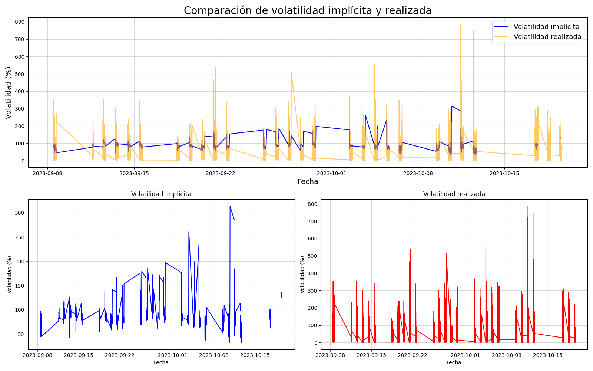
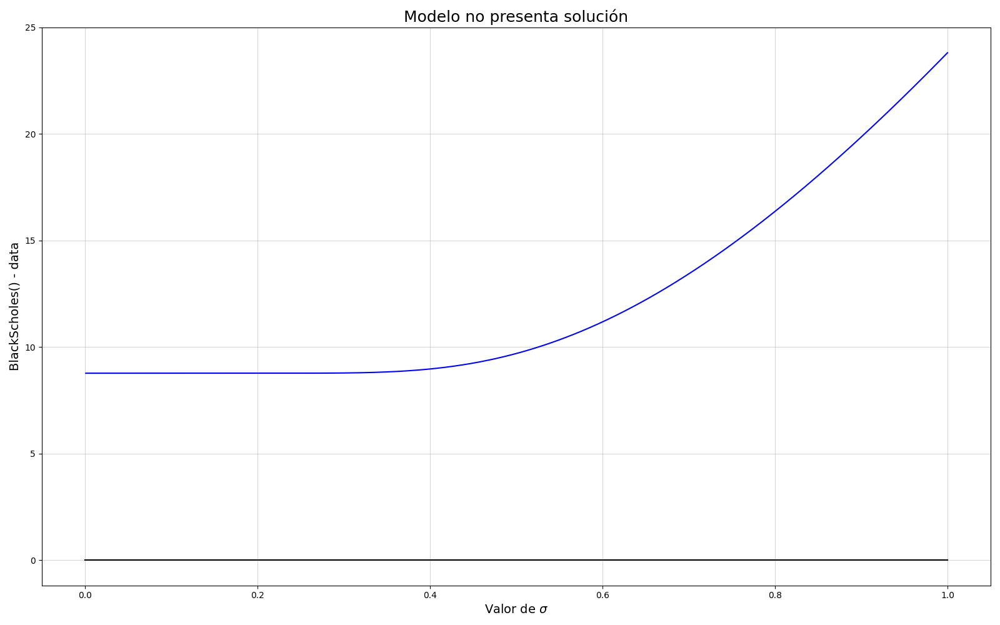

# Cálculo de la volatildiad implícita y realizada

# Introducción

En este repositorio se encuentran los archivos necesarios para poder realizar el cálculo de la volatilidad implícita y realizada para una serie de datos recibidos para este challenge.
En el caso de la volatilidad implícita se ha utilizado la fórmula de Black-Scholes y el método de Newton-Raphson para cálculo de raices para obtener una estimación de la misma. En el caso de la volatiliad realizada se ha utilizado la desviación standard. La descripción matemática del problema será descrita a continuación.

## Fundamentos matemáticos

### Volatilidad implícita

En el caso del cálculo de la volatilidad implícita se utilizó la fórmula de Black-Scholes la cual estima el precio de una opción a partir de varias variables.

$C= S N(d1) -K exp{-rt}N(d2)$

