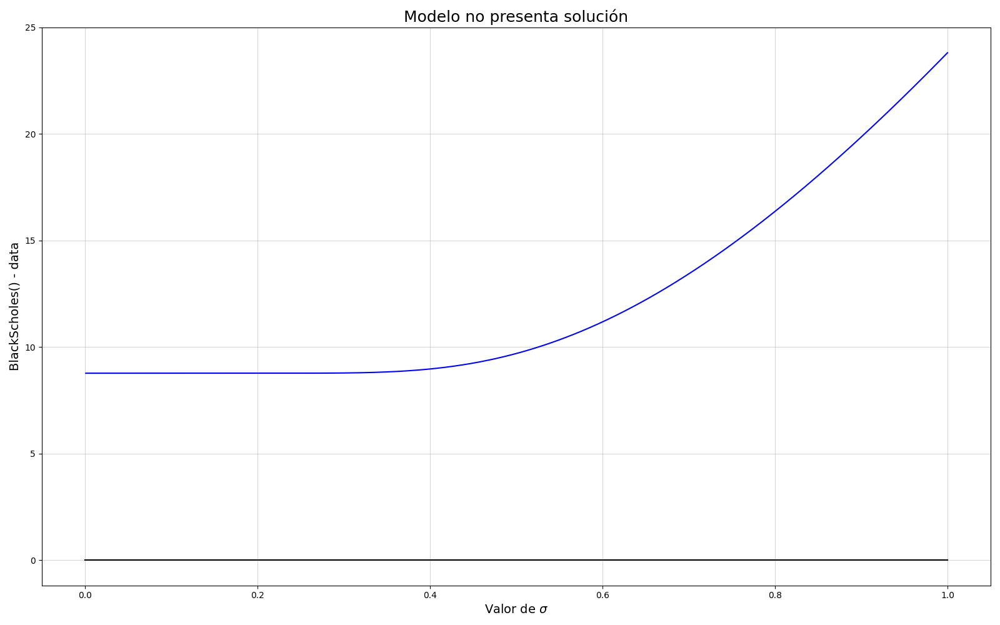
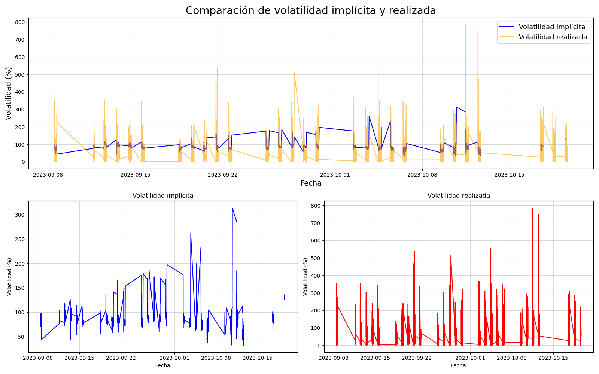

# Cálculo de la volatilidad implícita y realizada

## Introducción

En este repositorio se encuentran los archivos necesarios para poder realizar el cálculo de la volatilidad implícita y realizada para la serie de datos Exp_Octubre.csv recibido para este challenge.
En el caso de la volatilidad implícita se ha utilizado la fórmula de Black-Scholes y el método de Newton-Raphson para cálculo de raices para obtener una estimación de la misma. En el caso de la volatiliad realizada se ha utilizado la desviación standard modificada para tener en cuenta la falta de periodicidad temporal en los datos obtenidos. A continuación se darán instrucciones sobre como utilizar el programa y una descripción detallada de la resolución del problema.

## Cómo usar este programa

Para su correcto uso se deberán correr los archivos de la siguiente manera:

1. Clonar el repositorio
2. Correr el archivo dataPreprocessing.py
3. Correr el programa computeVols.cpp
4. Correr generateGraph.py
5. Correr noSolution.py

En este caso deberías finalizar con

- Dos archivos, implicitVols.csv y realizedVols.csv las cuales son los resultados obtenidos por el algoritmo. Y también dates.csv un archivo con las fechas utilizadas en los gráficos.
- Dos gráficos en formato .png, el primero volatilityComparison.png el cual muestra los resultados obtenidos para las volatilidades y el segundo noSolution.png el cual muestra la falta de solución para el modelo en algunos casos particulares.

## Fundamentos matemáticos

### Volatilidad implícita

En el caso del cálculo de la volatilidad implícita se utilizó la fórmula de Black-Scholes:

$C= S N(d1) -K \exp(-rt)N(d2)$

con

$d1 = \frac{\log{\frac{S}{K}} + (r + \frac{\sigma^{2}}{2})t}{\sigma \sqrt(t)}$

y

$d2 = d1 - \sigma \sqrt(t)$

donde
C es el valor de la opción, S es el valor del activo subyacente, K es el precio de strike, r es el interés libre de riesgo, t el time to maturity (calculado en años) y N la función de distribución de probabilidad acumulada de la normal.

Se utilizó también la derivada en función de sigma de la fórmula, conocida como Vega:

$Vega = \frac{dC}{d\sigma} = K F(d1) \sqrt(t)$

donde F es la función de distribución normal.

En nuestro problema para calcular la volatilidad implícita, se utilizó un algoritmo de root finding llamado [Newton-Raphson](https://en.wikipedia.org/wiki/Newton%27s_method) el cual consiste en compar el valor de la fórmula de Black-Scholes con los valores de la opción que se habían recibido y achicar la diferencia variando el valor de la volatilidad. En caso de que la diferencia fuera menor a un threshold el algoritmo consideró esa volatilidad como la implícita para ese punto.
La variación de la volatilidad en cada paso se obtuvo utilizando la derivada Vega de manera:

$v = - \frac{(BlackScholes() - data)}{Vega + v}$

### Volatilidad Realizada

En el caso de la volatilidad realizada, se realizó el cálculo utilizando la desviación standard de los retornos logaritmicos. Sin embargo, algo importante a tener en cuenta, fue que los puntos no se encontraban equiespaciados generando entonces la necesidad de agregar esta diferencia a la fórmula. Se incorporó un divisor con la diferencia entre los tiempos de los puntos, el cual funcionaba como peso. De esta manera, para puntos que se encontraran muy cerca temporalmente, se esperaria que la variación en su precio también fuera pequeña, y en caso de que no lo fuera se vería reflejado en el valor de la volatilidad realizada obtenido.

Se utilizó

$\sigma = \sqrt{\frac{1}{N}\sum_{i=1} \frac{r_{i}^{2}}{t_{i}- t_{i-1}}}$

donde

$r_{i} = \log{\frac{price_{i}}{price_{i-1}}}$

## Implementación y decisiones de diseño

En esta sección se describirán cada uno de los scripts que conforman este proyecto y se comentarán las múltiples decisiones de diseño que tomadas junto a su respectiva linea en el codigo.

### Preprocesamiento de datos.

Antes de realizar la implementación del cálculo de las volatilidades, se generó el script dataPreprocessing.py el cual preprocesaba los datos brindados para este challenge. En este script se realizó un tratamiento de las columnas que tenían datos erróneos,N/A o entradas extrañas. Además se realizó una transformación de las columnas para obtener una nueva tabla con tres columnas con: el promedio del precio entre bid y ask de la opción, el promedio del precio entre bid y ask del activo subyacente y el time to maturity medido en años.

De esta manera los datos quedaron preprocesados y listos para ser utilizados por nuestro programa desarrollado en C++.

### Modelado en C++

La implementación se realizó en el archivo computeVols.cpp. Al implementar los modelos mencionados en la sección de fundamentos matemáticos se realizaron múltiples decisiones de diseño.

- En el caso de errores que imposibilitaran el correcto funcionamiento del programa, se ordenó finalizar el mismo y enviar prints de errores por consola. Sin embargo, en otras ocasiones, el funcionamiento del programa no dependía explícitamente de el correcto funcionamiento de algunas lineas por lo que se agregó simplemente una flag con un warning. Por ejemplo, entre las líneas 33 a 62 se maneja de manera estricta la necesidad de haber efectivamente abierto el archivo, en caso de no haber sucedido se detiene el programa. Por otro lado, entre las lineas 184 a 187, se observa una flag agregada para mantener informado al usuario de posibles numeros Nan en su archivo de salida, aunque no imposibilita el funcionamiento del programa en este caso.

- Al definir las funciones utilizadas para el cálculo de las volatilidades entre las lineas 87 a 124, se mantuvo cada paso en funciones separadas para mantener la claridad del programa. Podría, por ejemplo, haberse incorporado las funciones d1 y d2, en las lineas 104 a 112, dentro de una misma función, o incluso haberlas incorporado directamente en la función BlackScholes, sin embargo, me pareció mas importante mantener la claridad de cada uno de los pasos por lo que se mantuvieron separadas.

- En la linea 143 se tuvo en cuenta la posibilidad de que la función Vega fuera muy cercana a 0, por lo que se agregó el valor de la volatilidad en el denominador, la cual inicialmente se propuso con un valor de 0.5 en cada iteración.

- Para el cálculo de la volatilidad realizada se consideró al calcularla las ventajas y desventajas de tomar una mayor cantidad de puntos para obtener efectivamente su valor. Además se puso en consideración también si era conveniente tomar puntos anteriores, o incluso utilizar una ventana temporal que tomara puntos delante y detrás del punto a calcular. Sin embargo, se decidió utilizar el punto a calcular y su punto anterior. De esta manera, los resultados obtenidos para la volatilidad realizada, reflejaron efectivamente los cambios a un plazo más corto del activo subyacente y por lo tanto se mantuvo relevante a lo largo de todos los puntos calculados. Podría haberse calculado de otra manera, pero en ese caso también podrían haberse obtenido volatilidades realizadas que no reflejaran efectivamente el comportamiento actual del activo al tomar puntos viejos y que no representaban efectivamente la actualidad del activo subyacente. Esta decisión de diseño fue puramente personal y podría haberse utilizado otra que contemplara puntos anteriores. Esta decisión dependería completamente del tipo de análisis que se buscara realizar. .

- En la implementación, en las lineas 167 y 168 se crearon dos variables para guardar el primer valor de el precio de la opción y del activo subyacente utilizados posteriormente en la segunda iteración del loop y en las lineas 203 y 204, se actualizó su valor para ser utilizado en la siguiente iteración. Dado que solo era necesario utilizar los precios del punto a calcular y de su punto anterior se generaron estas dos variables ya que era más conveniente que tener que cargar el vector entero de datos en cada una de las iteraciones. En caso de que hubiera tomado otro tipo de forma de calcular la volatilidad realizada, podría haber implementado esta sección de otra manera.

### Generación de gráficos

Para poder generar los gráficos utilizando los resultados del programa en C++ se generó un script llamado generateGraph.py donde se graficaron las volatilidades implícita y realizada obtenidas, juntas superpuestas y también por separado.
En un segundo archivo llamado noSolution.py, se incorporó un gráfico extra para mostrar la inexistencia de raíces en algunos casos que justificaran efectivamente los resultados obtenidos que serán discutidos en la siguiente sección.

## Resultados obtenidos

A partir del programa desarrollado, se obtuvieron dos tiras de datos para la volatilidad implícita y la volatilidad realizada. En el caso de la volatilidad implícita, se observó que existía la posibilidad de que no hubiera solución para la ecuacion $0 = BlackSholes() - C$. Esto se vió reflejado en que en varias iteraciones del algoritmo, en particular cuando los time to maturity empezaban a ser bajos, terminaban no convergiendo y generando un valor Nan en el vector de soluciones. Esta situación se puede observar en el siguiente gráfico:

Sin embargo, en la mayoría de los puntos no se tuvo este problema. Pero durante un período concentrado en la parte final de los datos, no se logró obtener puntos para la volatilidad implícita en la mayoría de los puntos calculados, por lo que no se tienen valores para esos casos.

En los casos no singulares, el algoritmo de root finding funcionó a la perfección y se obtuvieron valores para la volatilidad implícita. Esto mostró las limitaciones del modelo a la hora de predecir efectivamente el precio de una opción. Es decir, que existe un domino de parámetros que presenta una solución para la raíz, pero también al alejarnos mucho de valores "razonables" para el modelo, este pierde su efectividad.

En el caso de la volatilidad implícita, no se tuvieron problemas a la hora de realizar su cálculo. Se observó que los resultados obtenidos para la misma fueron mucho mas volátiles que los obtenidos para la volatilidad implícita. Esto se debe a la fórmula utilizada para el cálculo de la volatilidad realizada y su alto grado seguimiento del estado de la volatilidad actual del activo al tomar solo el punto anterior para calcularlo. Esto podría haberse disminuido utilizando una mayor cantidad de puntos para el cálculo de esta variable.

A continuación se observa el gráfico de los resultados obtenidos para ambas variables:

Como se hab♂a indicado anteriormente, en el caso de la volatilidad implícita, no fue posible realizar el cálculo de la misma para la mayoría de los datos cuando el time to maturity se volvió lo suficientemente pequeño.

De este gráfico se desprendieron dos conclusiones notables:

- Tanto en la volatilidad implícita como en la realizada, al acercarse al time to maturity su volatilidad va en aumento, incluso observando picos máximos bien marcados en ambos casos, para luego descender abruptamente a valores mucho menores. Esto podría deberse a que la opción deja de ser interesante para el cliente/inversor a partir de un tiempo determinado y por lo tanto su volatilidad disminuye de manera considerable al haber menos intercambio de la misma.
- Teniendo en cuenta que la volatilidad implícita estaría anticipando la esperanza de volatilidad del activo en el futuro, la volatilidad realizada calculada poco tiempo después mantuvo una correlación muy alta con lo observado para la implícita. Es decir, que poco tiempo después de aumentar la volatilidad implícita esto se vió reflejado en la volatilidad realizada. Mostrando que efectivamente este puede ser un indicador de la volatilidad futura del activo. Esto se puede observar claramente, por ejemplo, en el caso del pico máximo observado, donde la volatilidad implícita presenta un salto muy grande y poco tiempo después se ve reflejado en la volatilidad realizada.
